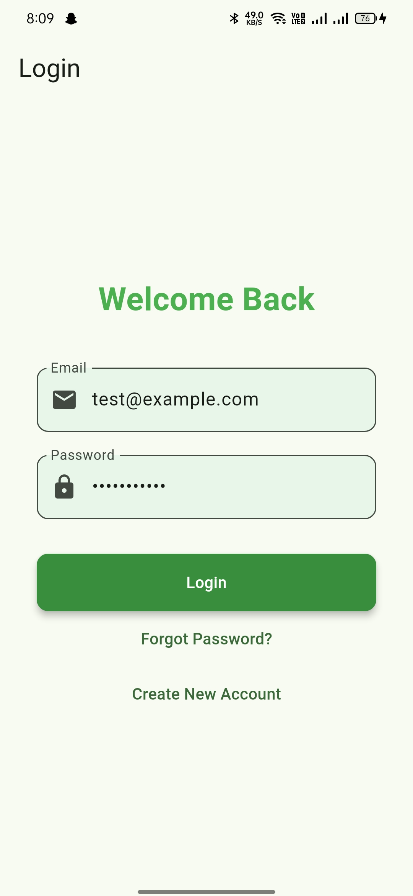
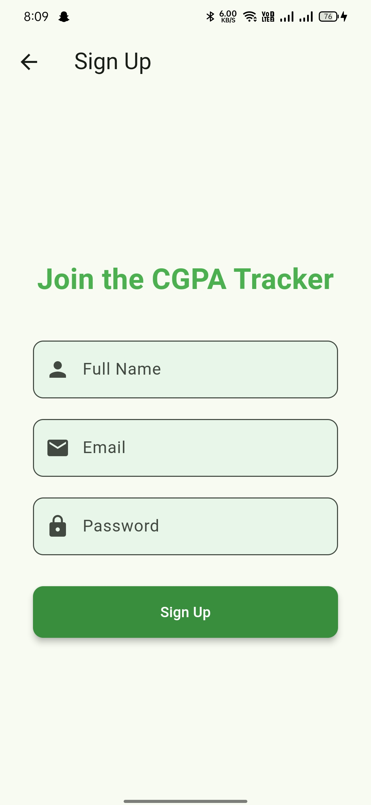
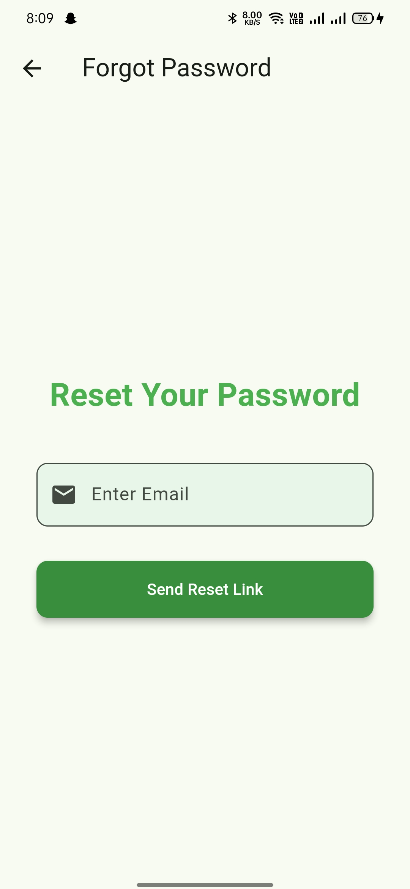
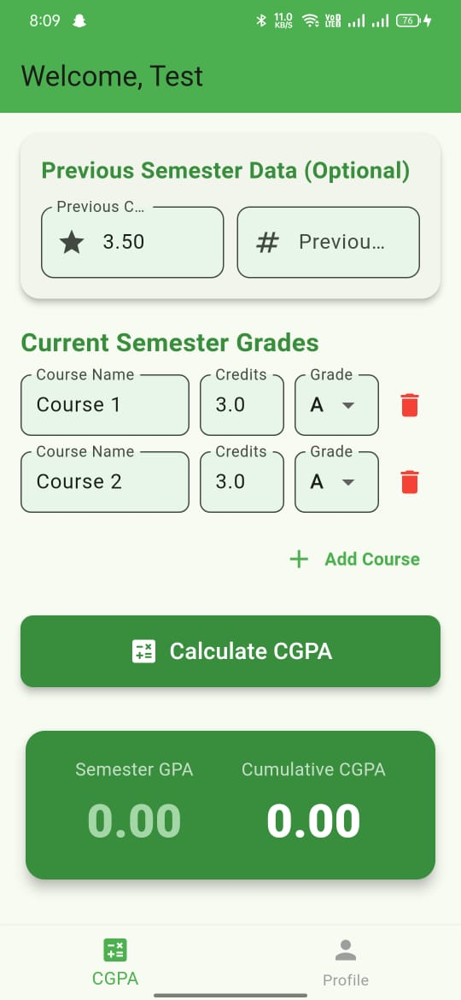
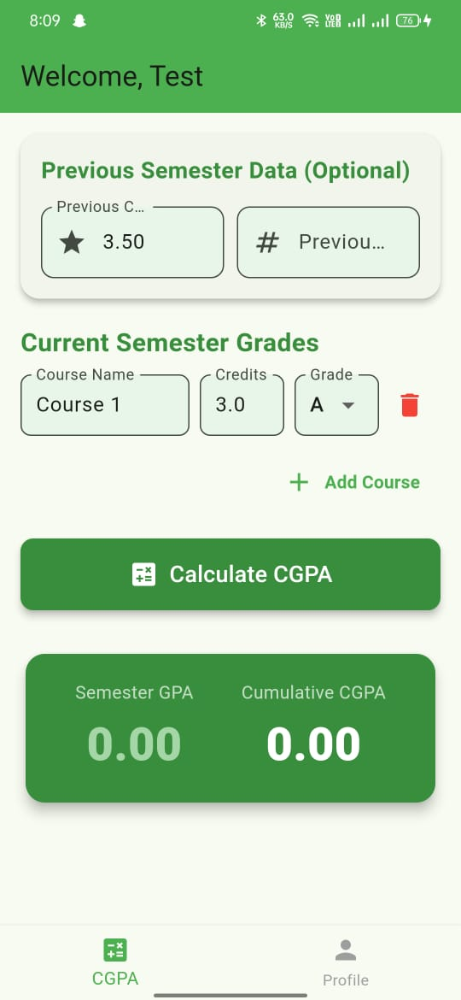

# 🎓 **Flutter CGPA Calculator App**

A simple and elegant Flutter application to calculate your **CGPA** easily with a clean user interface and smooth user experience.

---

## 📱 **App Screenshots**

  
  
  
  
  

---

## 🚀 **Features**

* 🧮 Calculate CGPA with ease
* 💾 Save and view previous results
* 🎨 Modern UI with Flutter Material Design
* 🔐 Secure login and signup screens
* 🌙 Clean layout and responsive design
