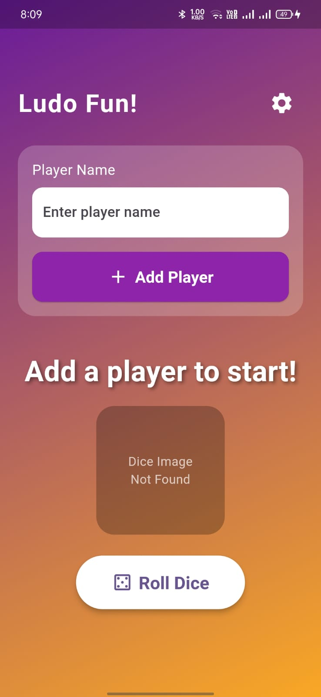

# Ludo Fun\! - A Flutter Dice Game

This is a fun and simple dice rolling application built with Flutter. It's perfect for keeping score when playing board games like Ludo. 🎲

-----

## Features ✨

  - **Player Management:** Add up to 4 players to the game.
  - **Animated Dice Roll:** A visually appealing dice with a 3D rotation and scaling animation.
  - **Score Tracking:** The app automatically keeps track of each player's score.
  - **Turn Indicator:** Clearly shows which player's turn it is to roll the dice.
  - **Theme Customization:** Switch between Light, Dark, and System default themes.

-----

## Screenshots

  
  
  
  

