# 📱 Smart POS (Point of Sale) System
**A Complete Mobile-Based Retail Management Solution**

---

## 📌 Project Introduction

The **Smart POS (Point of Sale) System** is a mobile-based retail management application developed using **Flutter**.  
It is designed to digitize and automate retail operations such as **user authentication, inventory management, sales processing, receipt generation, and returns handling**.

The application follows an **offline-first architecture** using **SQLite**, ensuring smooth and reliable performance even without an active internet connection.

---

## 🎯 Project Objectives

- Automate retail billing and sales processes  
- Provide secure **Login & Registration** functionality  
- Manage inventory with real-time stock updates  
- Reduce manual and calculation errors  
- Generate professional digital receipts  
- Support offline data storage  
- Build a scalable system for future enhancements  

---

## 🧩 Problem Statement

Many small and medium-sized retail businesses still rely on manual billing systems, which are:

- Time-consuming  
- Error-prone  
- Difficult to manage  
- Lacking proper sales records  

The **Smart POS System** solves these problems by providing a **secure, fast, and user-friendly mobile POS solution**.

---

## ✨ Functional Features

### 🔐 Authentication System
- User Registration  
- Secure Login  
- Session-based access control  
- Prevents unauthorized usage  

### 📦 Inventory Management
- Add, Update, and Delete products (CRUD)  
- Real-time stock quantity tracking  
- Low-stock visual indicators  
- Product image support  
- SKU-based product identification  
- Category-wise organization  

### 📂 Category Management
- Create, Update, Delete categories  
- Improved navigation and product grouping  

### 🛒 Point of Sale (Checkout)
- Dynamic shopping cart  
- Add / remove products in real time  
- Automatic price & total calculation  
- Multiple payment methods:
  - Net Payment  
  - Installment Payment  
- Smooth checkout workflow  

### 📄 Receipt Generation & Printing
- Professional PDF receipt generation  
- QR Code integration for order verification  
- Print, save, or share receipts digitally  

### ↩️ Returns & Order History
- Complete transaction history  
- Date-wise sorting  
- Full and partial product returns  
- Automatic inventory synchronization  

### 🏢 Business Settings
- Configure Business Name, Address, Contact  
- Customize Receipt Header & Footer  
- Default Currency & Date Format  
- Enable or disable Receipt Printing  
- Ensures professional branding for all transactions  

---

## 🏗️ System Architecture

The application follows a **layered architecture**:

1. **Presentation Layer** – Flutter UI & Material Design  
2. **Business Logic Layer** – Authentication, Cart, Orders, Payments  
3. **Data Layer** – SQLite (Offline-first local database)  

---

## 🗄️ Database Design Overview

- **Users** (ID, Name, Email, Password)  
- **Products** (ID, Name, Price, Stock, Category, Image)  
- **Categories** (ID, Name)  
- **Orders** (ID, Date, Total, Payment Method)  
- **Order Items** (Order ID, Product ID, Quantity, Price)  

---

## 🛠️ Technology Stack

| Component | Technology |
|---------|------------|
| Framework | Flutter (Dart) |
| Database | SQLite (`sqflite`) |
| Authentication | Local Authentication |
| PDF & Printing | `pdf`, `printing` |
| Image Handling | `image_picker` |
| Utilities | `intl`, `uuid` |

---

## 🎥 Demo & APK

▶ **Demo / APK Link:**  
👉 [Download APK & Demo](https://drive.google.com/drive/folders/1tV-ycOh7MDpjkTSxFMz9btvFbHqXz3Ec)

> The link contains the APK file and demonstration video showing login, inventory management, checkout, receipt generation, business settings, dashboard, and returns.

---

## 📸 Application Screenshots

> Screenshots demonstrate the complete workflow. Each image is framed with border and caption for a professional look.

### 🔐 Authentication Screens

<p align="center">
  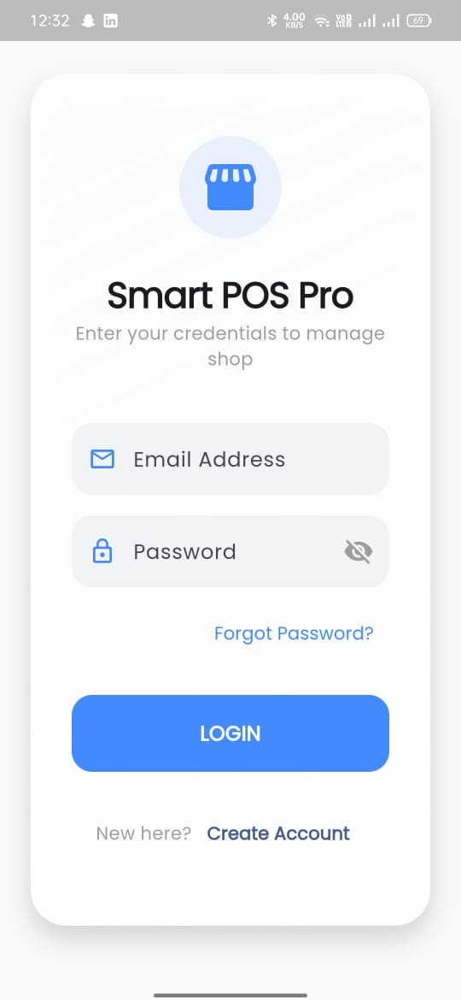
  <br>**Login Screen**
  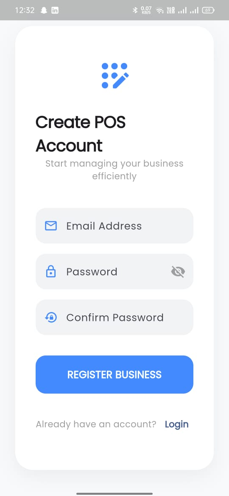
  <br>**Register Screen**
</p>

---

### 📊 Dashboard & Recent Transactions

<p align="center">
  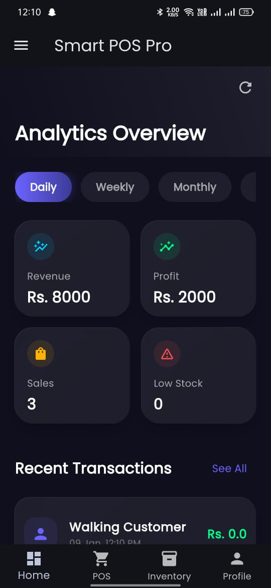
  <br>**Dashboard Overview**
  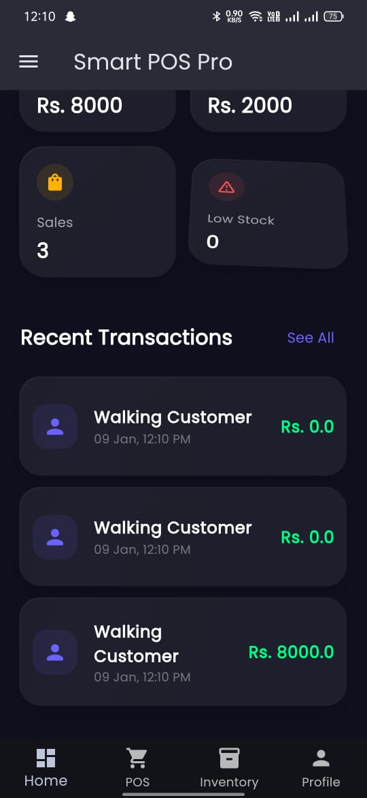
  <br>**Recent Transactions**
</p>

---

### 🏢 Business Settings

<p align="center">
  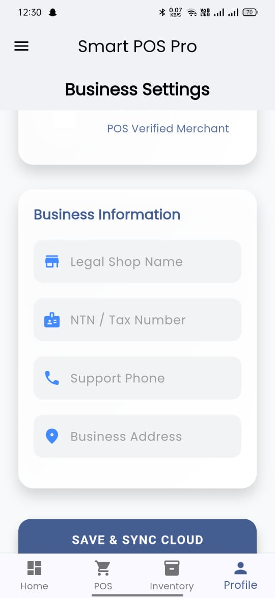
  <br>**Business Settings**
</p>

---

### 📦 Inventory & Product Management

<p align="center">
  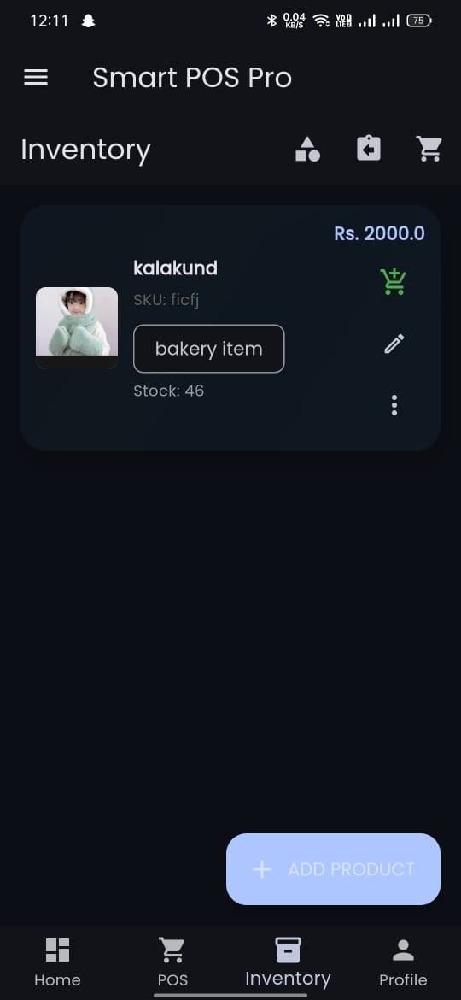
  <br>**Inventory Screen**
  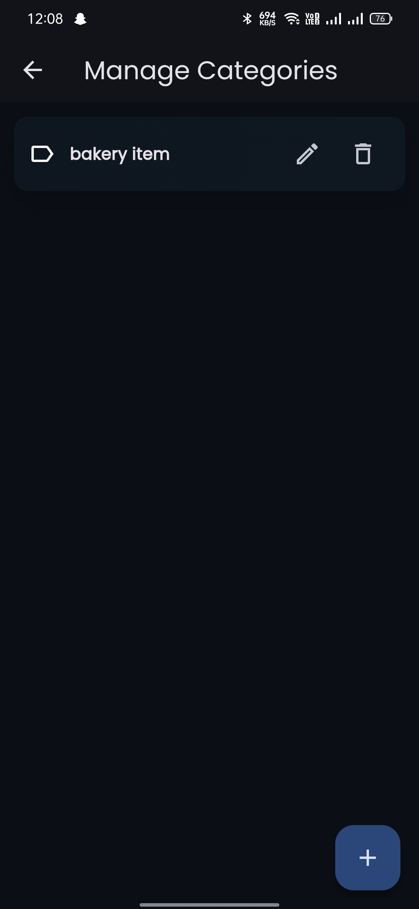
  <br>**Add Category**
  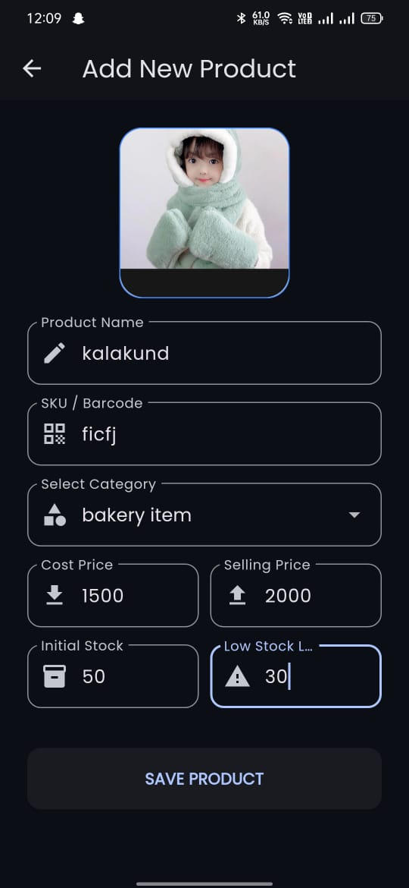
  <br>**Add Product**
</p>

<p align="center">
  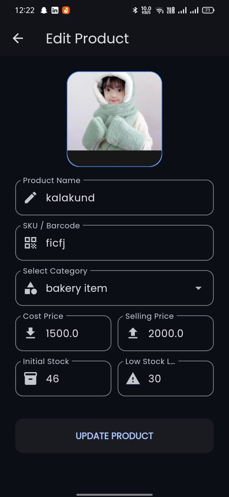
  <br>**Edit Product**
</p>

---

### 🛒 Cart & Checkout Process

<p align="center">
  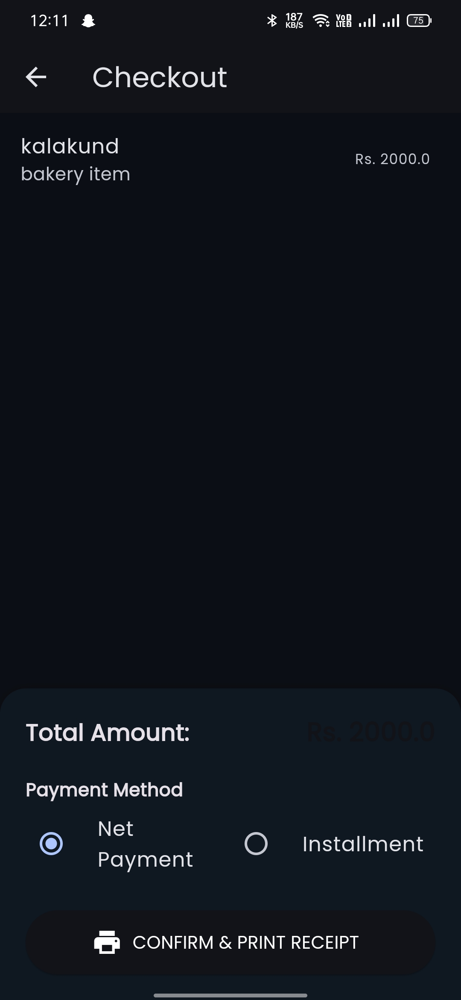
  <br>**Checkout Screen**
</p>

---

### 📄 Receipt & Order History

<p align="center">
  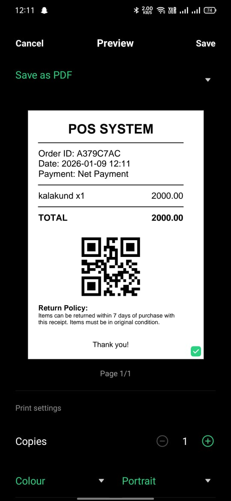
  <br>**Generated Receipt**
</p>

---

### ↩️ Returns Management

<p align="center">
  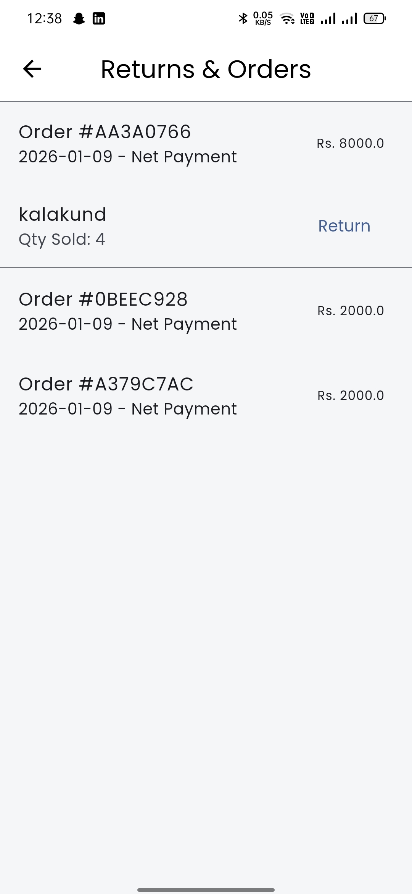
  <br>**Return Screen**
  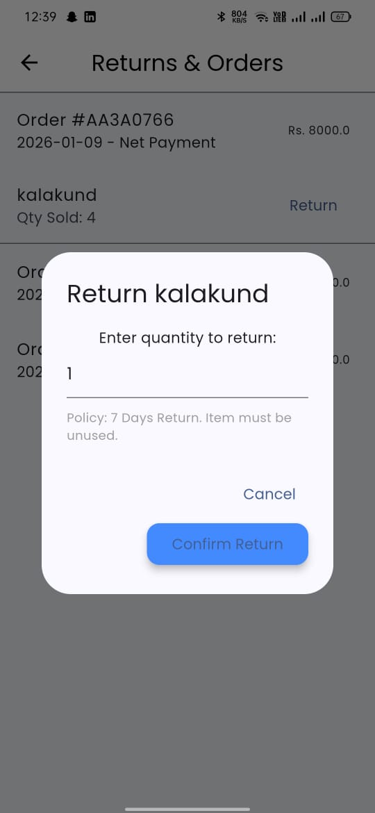
  <br>**Partial Return**
</p>

---

## 🚀 Application Workflow

1. User registers or logs in  
2. Inventory and categories are managed  
3. Products are added to cart  
4. Checkout process is initiated  
5. Payment method is selected  
6. Receipt is generated and printed  
7. Orders are stored in history  
8. Returns are processed if required  

---

## ⚙️ Installation & Setup

### Prerequisites
- Flutter SDK  
- Android Studio / VS Code  
- Android Emulator or Physical Device  

### Steps to Run

```bash
flutter pub get
flutter run
