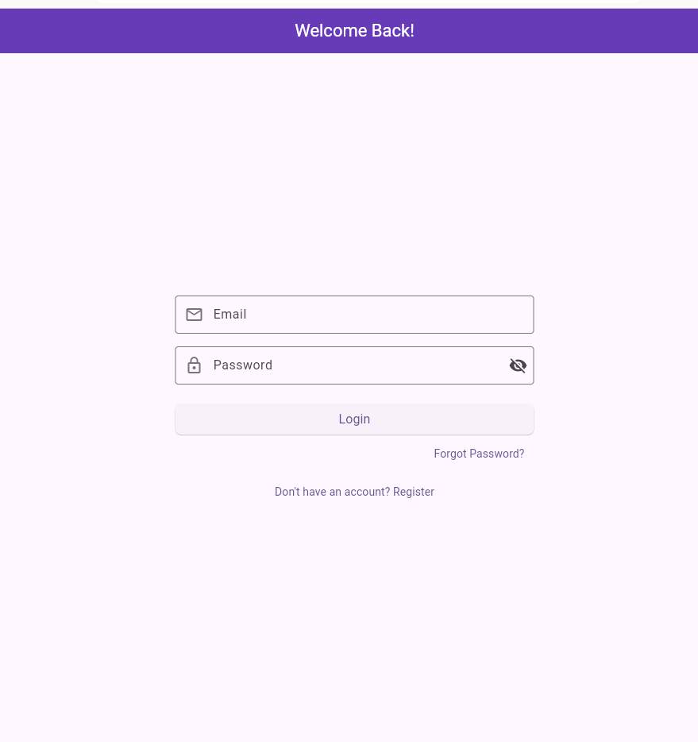
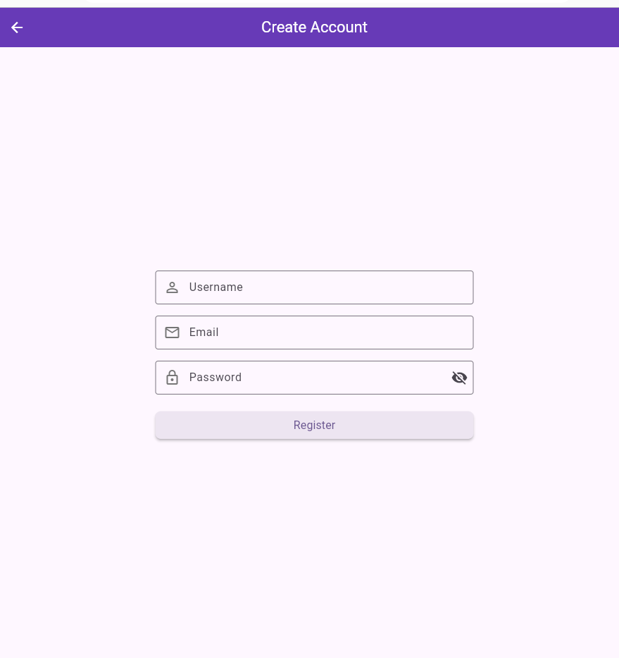
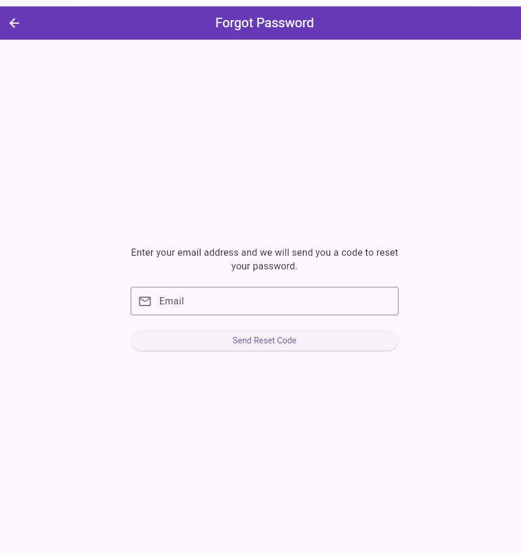
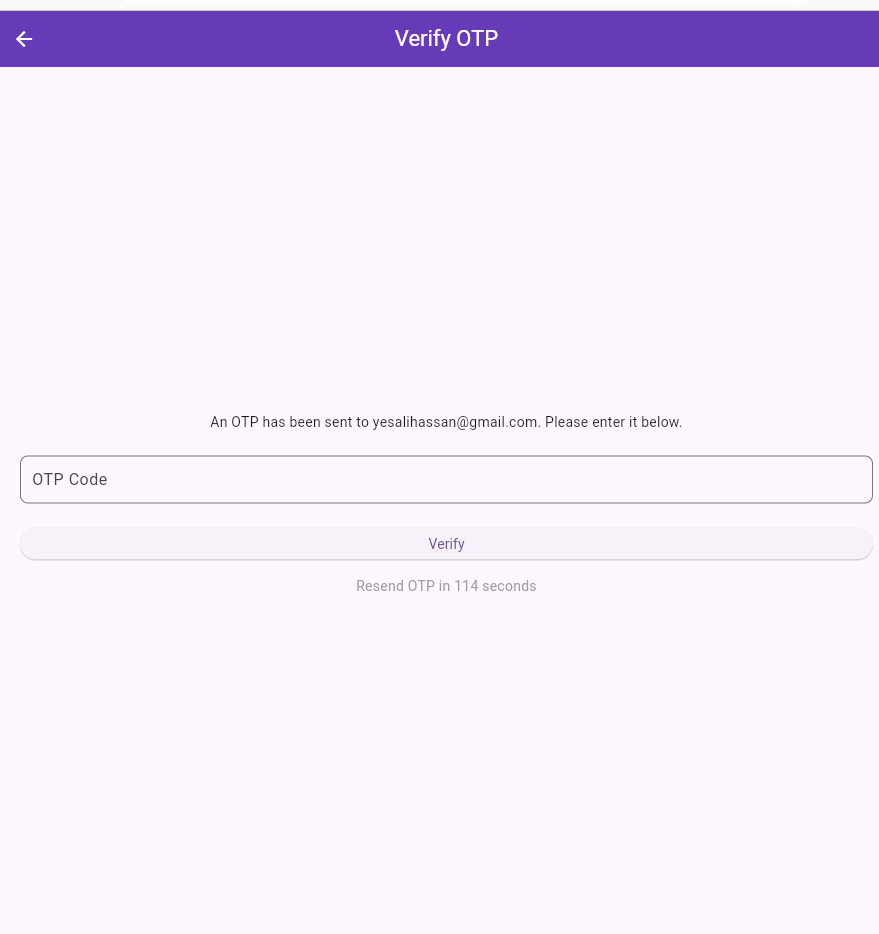
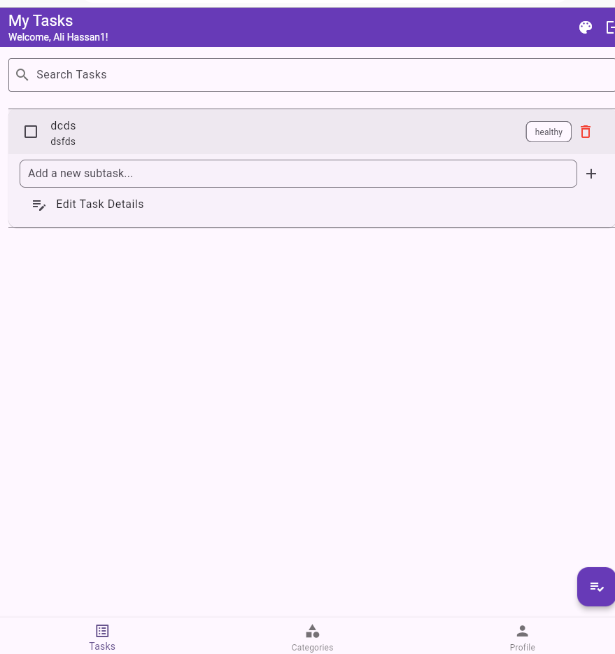
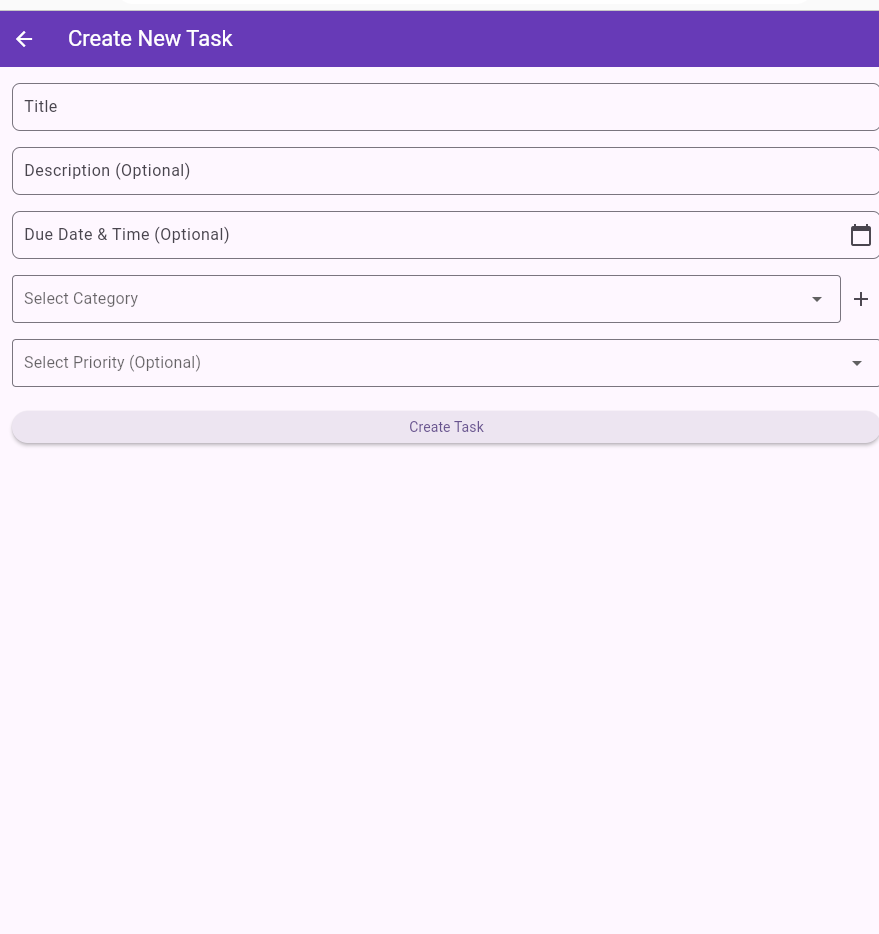
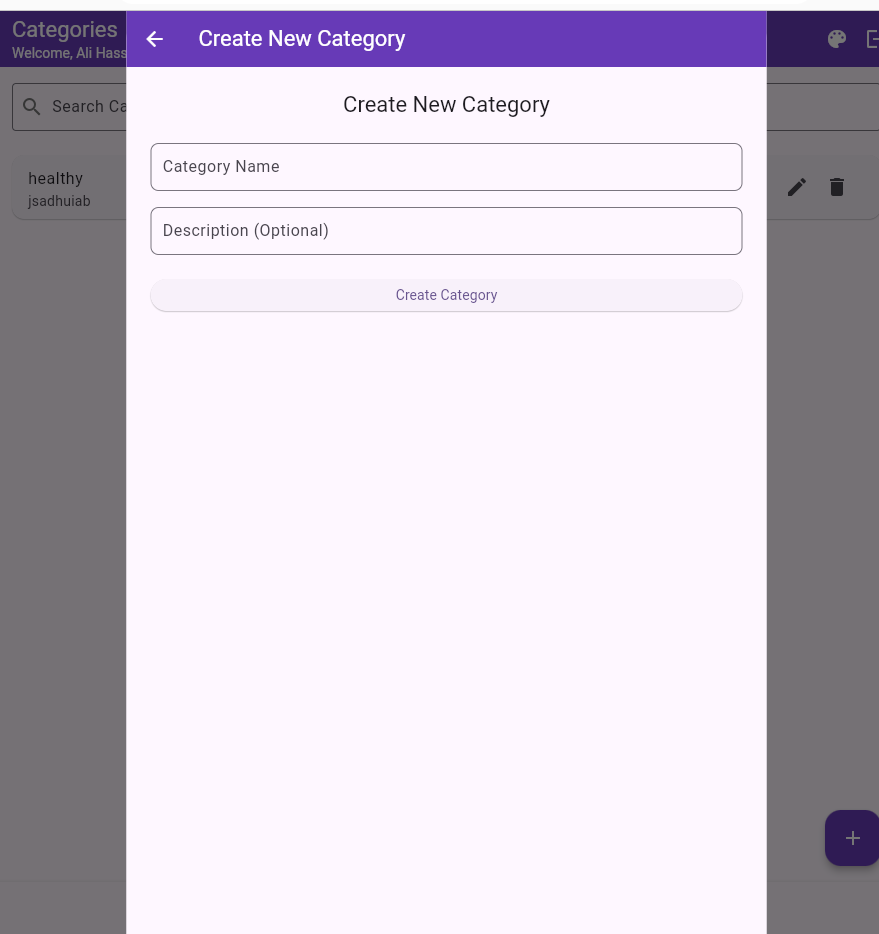
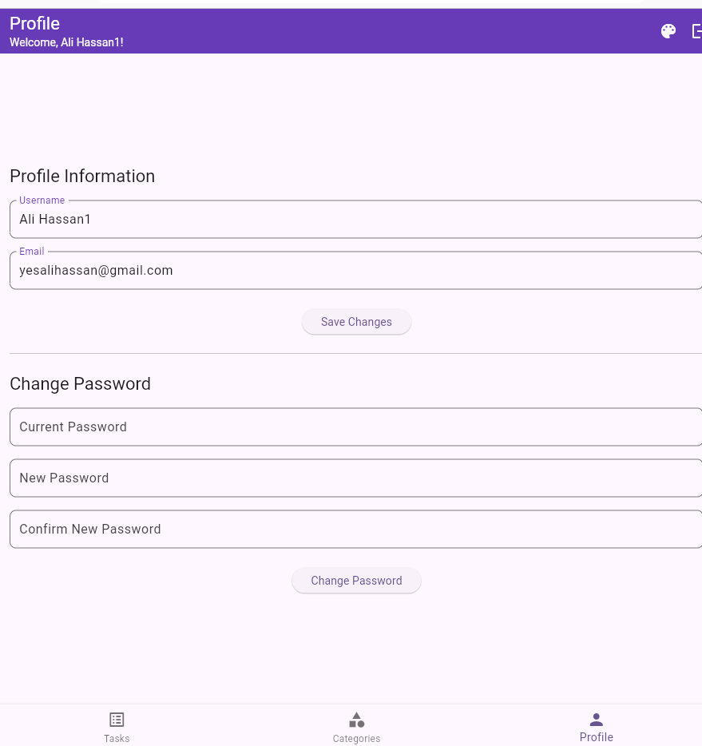

# Task Management App

This is a full-stack task management application built with a Flutter frontend and a corresponding backend service. It allows users to manage their tasks, categorize them, and receive notifications for due dates.

## Features

*   **User Authentication**: Secure user registration, login, and session management.
*   **Password Management**:
    *   Forgot password flow with email-based OTP verification.
    *   Ability for logged-in users to update their password.
*   **Profile Management**: Users can view and update their profile information (username, email).
*   **Task Management (CRUD)**:
    *   Create, view, update, and delete tasks.
    *   Mark tasks as complete.
    *   Assign priority, due dates, and descriptions.
*   **Category Management (CRUD)**:
    *   Create, view, update, and delete categories to organize tasks.
*   **Subtask Management (CRUD)**:
    *   Add, update, and delete subtasks within a main task.
    *   Mark subtasks as complete.
*   **Local Notifications**: Schedules and displays on-device notifications when a task is due.

## Screenshots

<table>
  <tr>
    <td align="center"> <b>Login Screen</b></td>
    <td align="center"> <b>Register Screen</b></td>
    <td align="center"> <b>Forgotten password</b></td>
    <td align="center"> <b>Opt Verification</b></td>
  </tr>
  <tr>    
    <td align="center"> <b>Task List</b></td>
    <td align="center"> <b>Create Task Form</b></td>
    <td align="center"> <b>Category Management</b></td>
    <td align="center"> <b>User Profile</b></td>
  </tr>
</table>

## Tech Stack & Key Packages

*   **Framework**: [Flutter](https://flutter.dev/)
*   **HTTP Client**: [Dio](https://pub.dev/packages/dio) for making API requests.
*   **Local Notifications**: [flutter_local_notifications](https://pub.dev/packages/flutter_local_notifications) for scheduling reminders.
*   **Secure Storage**: [flutter_secure_storage](https://pub.dev/packages/flutter_secure_storage) for safely storing the user's auth token.
*   **Timezone Handling**: [flutter_timezone](https://pub.dev/packages/flutter_timezone) to handle timezones for notifications correctly.

## Getting Started

### Prerequisites

1.  **Flutter SDK**: Ensure you have Flutter installed. For installation guidance, see the [official Flutter documentation](https://docs.flutter.dev/get-started/install).
2.  **Backend Server**: This frontend requires the corresponding backend server to be running.
3.  An emulator or physical device to run the app.
